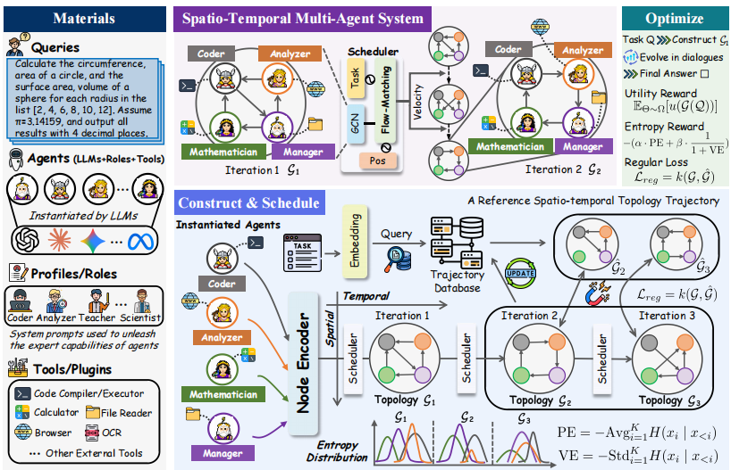
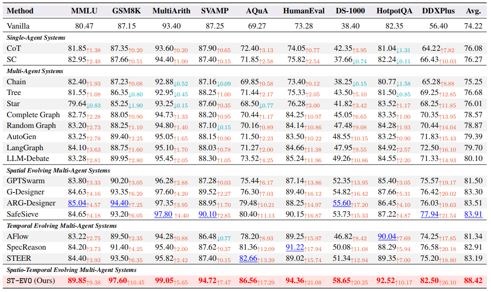

<div align="center">

# ST-EVO: Towards Generative Spatio-Temporal Evolution of Multi-Agent Communication Topologies

[](https://www.python.org/downloads/)
[](https://pytorch.org/)
[](LICENSE)
[](https://arxiv.org/pdf/2602.14681)

[**Paper**](https://arxiv.org/pdf/2602.14681) | [**Documentation**](#quick-start) | [**Citation**](#citation)

</div>

---

## 📖 Overview

**ST-EVO** is a novel framework for learning generative spatio-temporal evolution of communication topologies in multi-agent systems. Unlike traditional approaches that rely on fixed or rule-based topologies, ST-EVO dynamically adapts communication structures based on spatial configurations and task requirements.

<div align="center">
  
  <p><em>Figure 1: ST-EVO Framework - Generative approach for evolving multi-agent communication topologies</em></p>
</div>

### Key Features

- 🔄 **Dynamic Topology Evolution**: Learns to generate communication graphs that evolve over both space and time
- 🎯 **Adaptive Communication**: Integrates spatial relationships with temporal dynamics for optimal coordination
- 🚀 **End-to-End Learning**: Learns optimal structures directly from task objectives without manual design
- 📊 **Multiple Topology Support**: FullConnected, Ring, Star, and custom spatial topologies
- 🧪 **Comprehensive Evaluation**: Benchmarked on MMLU, GSM8K, HumanEval, and more

---

## 🔬 Technical Approach

ST-EVO addresses the challenge of static communication topologies in multi-agent systems through:

1. **Spatio-Temporal Reasoning**: Captures agent positions and relationships to create adaptive communication patterns
2. **Generative Topology Evolution**: Uses generative models to predict and evolve graph structures dynamically
3. **Strategic Multi-Agent Coordination**: Enables agents to reason strategically about when and how to communicate

<div align="center">
  
  <p><em>Figure 2: Performance comparison across different topologies and benchmarks</em></p>
</div>

### Architecture Components

- **Graph Module** (`STEVO/graph/`): Implements dynamic graph structures and RAG-based knowledge retrieval
- **Evolver** (`STEVO/evolver/`): Handles topology evolution and optimization
- **LLM Backend** (`STEVO/llm/`): Integrates with large language models for agent reasoning
- **Datasets** (`datasets/`): Supports MMLU, GSM8K, HumanEval, DS1000, AQUA, SVAMP, and MultiArith

---

## 🚀 Quick Start

### Prerequisites

- Python 3.10+
- CUDA 12.1+ (for GPU support)
- 16GB+ RAM recommended

### Installation

1. **Clone the repository**

```bash
git clone https://github.com/DecisionIntelligence/STEVO.git
cd STEVO
```

2. **Create conda environment**

```bash
conda create -n stevo python=3.10
conda activate stevo
```

3. **Install dependencies**

```bash
pip install -r requirements.txt
```

### Configuration

1. **Set up API keys**

Copy `template.env` to `.env` and configure your API credentials:

```bash
cp template.env .env
```

Edit `.env` with your settings:

```bash
BASE_URL=your_openai_compatible_base_url_here
API_KEY=your_api_key_here
```

2. **Download datasets**

Download the required datasets:
- [MMLU](https://github.com/hendrycks/test)
- [HumanEval](https://github.com/openai/human-eval)
- [GSM8K](https://github.com/openai/grade-school-math)

Place them in appropriate folders under the `datasets/` directory.

---

## 🧪 Running Experiments

### MMLU Benchmark

Run ST-EVO on MMLU dataset with FullConnected topology:

```bash
python experiments/run_mmlu.py \
    --mode FullConnected \
    --batch_size 4 \
    --agent_nums 6 \
    --num_iterations 10 \
    --num_rounds 1 \
    --optimized_spatial
```

### GSM8K Benchmark

Evaluate mathematical reasoning:

```bash
python experiments/run_gsm8k.py \
    --mode FullConnected \
    --batch_size 4 \
    --agent_nums 4 \
    --num_iterations 10 \
    --num_rounds 1 \
    --optimized_spatial
```

### HumanEval Benchmark

Test code generation capabilities:

```bash
python experiments/run_humaneval.py \
    --mode FullConnected \
    --batch_size 4 \
    --agent_nums 4 \
    --num_iterations 10 \
    --num_rounds 1 \
    --optimized_spatial
```

### Available Topology Modes

- `FullConnected`: All agents communicate with each other
- `Ring`: Agents form a ring communication structure
- `Star`: Hub-and-spoke topology with central coordinator
- `Spatial`: Custom spatial-aware topology (use with `--optimized_spatial`)

---

## 📊 Datasets Supported

| Dataset | Task Type | Metrics | Script |
|---------|-----------|---------|--------|
| **MMLU** | Multi-task Q&A | Accuracy | `run_mmlu.py` |
| **GSM8K** | Math Reasoning | Accuracy | `run_gsm8k.py` |
| **HumanEval** | Code Generation | Pass@k | `run_humaneval.py` |
| **DS1000** | Data Science | Execution | `run_ds1000.py` |
| **AQUA** | Algebraic QA | Accuracy | `run_aqua.py` |
| **SVAMP** | Math Word Problems | Accuracy | `run_svamp.py` |
| **MultiArith** | Arithmetic | Accuracy | `run_multiarith.py` |

---

## 📁 Project Structure

```
STEVO/
├── STEVO/                  # Core framework
│   ├── llm/               # LLM integration
│   ├── graph/             # Graph and topology management
│   ├── evolver/           # Topology evolution logic
│   └── tools/             # Utility tools
├── experiments/           # Experimental scripts
│   ├── run_mmlu.py
│   ├── run_gsm8k.py
│   ├── run_humaneval.py
│   └── ...
├── datasets/              # Dataset loaders
├── docs/                  # Documentation and figures
├── requirements.txt       # Python dependencies
└── template.env          # Environment configuration template
```

---

## 📈 Results

ST-EVO demonstrates superior performance across multiple benchmarks:

- **MMLU**: Improved accuracy through adaptive topology evolution
- **GSM8K**: Enhanced mathematical reasoning via strategic agent communication
- **HumanEval**: Better code generation through dynamic collaboration patterns

For detailed results, please refer to our [paper](https://arxiv.org/pdf/2602.14681).

---

## 🔧 Advanced Usage

### Custom Topologies

You can define custom communication topologies by extending the graph module:

```python
from STEVO.graph import Graph

# Define your custom topology
custom_graph = Graph(mode="Custom", agent_nums=6)
# Add your topology logic
```

### Training on Custom Datasets

1. Create a dataset loader in `datasets/your_dataset.py`
2. Implement the dataset interface
3. Add a run script in `experiments/run_your_dataset.py`

---

## 📝 Citation

If you find ST-EVO useful in your research, please cite our paper:

```bibtex
@inproceedings{wu2026stevo,
  title={ST-EVO: Towards Generative Spatio-Temporal Evolution of Multi-Agent Communication Topologies},
  author={Wu, Xingjian and Liu, Xvyuan and Lu, Junkai and Wang, Siyuan and Qiu, Xiangfei and Shu, Yang and Hu, Jilin and Guo, Chenjuan and Yang, Bin},
  booktitle={Proceedings of the 2026 Conference on Empirical Methods in Natural Language Processing (EMNLP)},
  year={2026},
  url={https://arxiv.org/pdf/2602.14681}
}
```

---

## 📄 License

This project is licensed under the MIT License - see the [LICENSE](LICENSE) file for details.

---

## 🤝 Contributing

We welcome contributions! Please feel free to submit issues and pull requests.

---

## 📧 Contact

For questions or collaboration opportunities, please contact:

- [Xingjian Wu](https://ccloud0525.github.io/) ([xjwu@stu.ecnu.edu.cn](mailto:xjwu@stu.ecnu.edu.cn))

---

## 🙏 Acknowledgments

This work was accepted at **EMNLP 2026 Main Conference**. We thank the reviewers for their valuable feedback and the community for their support.

---